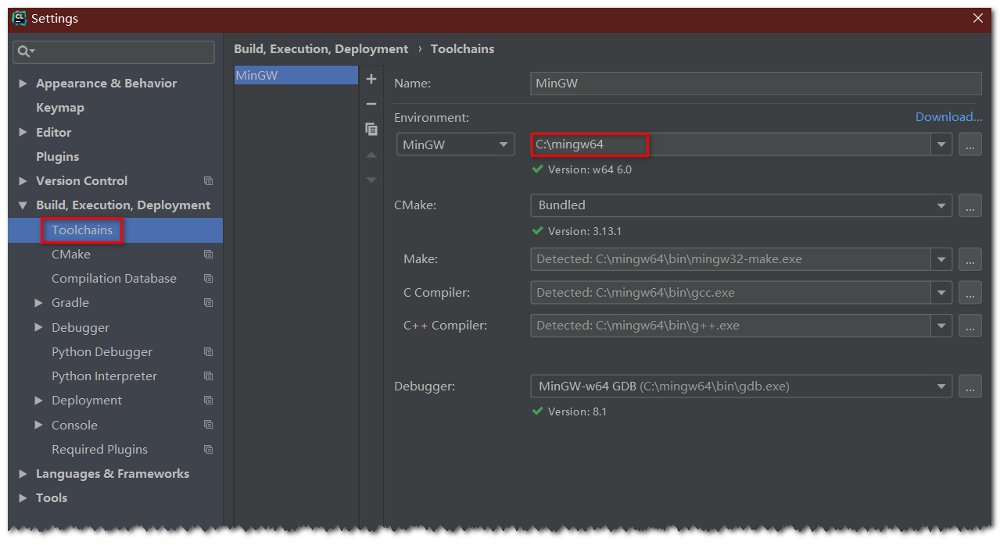

# Windows 10 Clion 配置 Opencv 4.0.1

## 系统及软件环境

* Windows-10-64bit
* MinGW-w64-x86_64-8.1.0-release-posix-seh-rt_v6-rev0
* CMake-3.13.1
* opencv-4.0.1-vc14_vc15
* Clion 2018.3.1

## 安装环境

以下环境的安装参考 [Windows10 环境下使用 Cmake 和 MinGW-w64 编译安装 OpenCV 4.0.1]()

* 安装 MinGW-w64
* 安装 Cmake
* 编译 OpenCV 4.0.1

## 配置 OpenCV 环境

将下列路径添加到 `path` 环境中(根据自己的编译情况不同，路径可能不同，需要**更改**为对应的路径)

* `D:\opencv\mingw-build\install\x64\mingw\bin`

## 配置 Clion

在 `setting` 下的 `Toolchain` 配置好 `MinGW` 的路径



## 修改 CmakeList.txt 文件

在 `CmakeList.txt` 中添加以下代码

```bash
set(OpenCV_DIR D:\\opencv\\mingw-build)
find_package(OpenCV REQUIRED)
include_directories(${OpenCV_INCLUDE_DIRS})
target_link_libraries(open_test ${OpenCV_LIBS})
```

**注**：`open_test` 为项目名称


## 执行测试代码

```cpp
// main.cpp
#include <iostream>
#include <opencv2/highgui/highgui.hpp>

using namespace std;
using namespace cv;

int main() {
    Mat img = imread("D:\\opencv\\sources\\doc\\tutorials\\images\\objdetect.jpg");
    if (img.empty()) {
        cout << "Error" << endl;
        return -1;
    }
    namedWindow("pic", WINDOW_FULLSCREEN);
    imshow("pic", img);
    waitKey();
    return 0;
}
```

如果能够正常显示图像，则 CLion 中 OpenCV 配置成功！