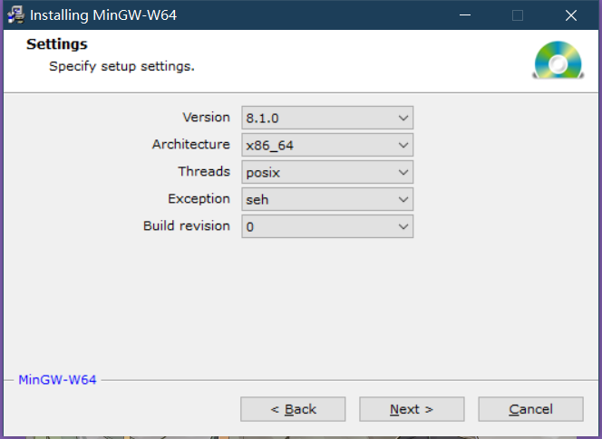
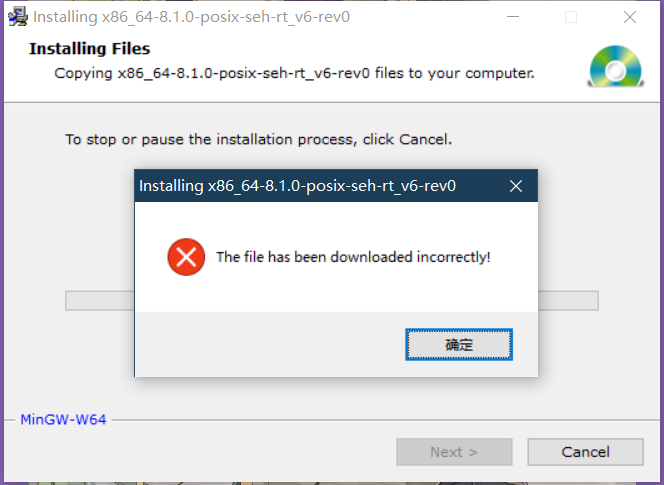
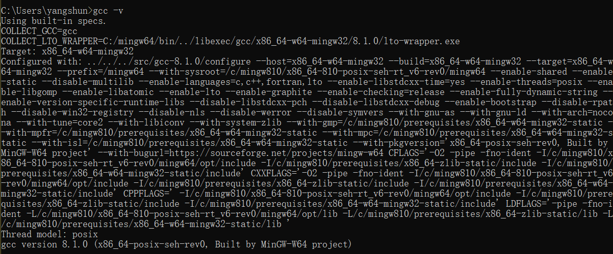
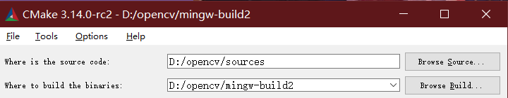
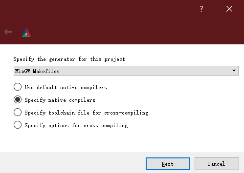
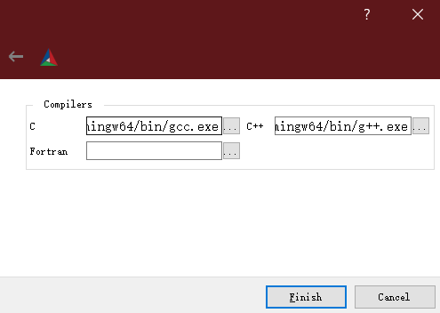

# Windows10 环境下使用 Cmake 和 MinGW-w64 编译安装 OpenCV 4.0.1

## 系统及软件环境

* Windows-10-64bit
* MinGW-w64-x86_64-8.1.0-release-posix-seh-rt_v6-rev0
* CMake-3.13.1
* opencv-4.0.1-vc14_vc15

## 安装 MinGW-w64 并配置其环境变量

### 通过 window 安装文件来安装

1. 下载 MinGW-w64，下载地址： [MinGW-w64 - for 32 and 64 bit Windows](https://sourceforge.net/projects/mingw-w64/files/mingw-w64/mingw-w64-release/)

2. 安装 MinGW-w64.以管理员的身份执行安装程序，根据自己环境的情况选择安装的包

    

    然后执行下一步，如果这步出现错误就*通过离线的方式来配置*

    

3. 离线配置 MinGW-w64. 如果使用 `.exe` 文件安装出现错误，可以通过离线的方式来配置 MinGW-w64. 具体步骤参考下面内容。

### 通过离线包进行安装

1. 下载对应版本的离线包，下载地址：[x86_64-8.1.0-release-posix-seh-rt_v6-rev0.7z](https://sourceforge.net/projects/mingw-w64/files/Toolchains%20targetting%20Win64/Personal%20Builds/mingw-builds/8.1.0/threads-posix/seh/)

2. 提取文件到任意路径，我是直接放在 `C:\` 目录下；

3. 配置环境变量，将 `X:\mingw64\bin`(`X` 为提取目录) 添加到环境变量的 `path` 变量中，然后打开命令行执行器输入 `gcc -v`, 如果出现对应的版本号则表示配置成功。

    

## 使用 Cmake 生成 OpenCV 的 Makefile

1. 下载对应平台的 cmake 并安装，下载地址： [cmake](https://cmake.org/download/)

2. 下载 Opencv 安装文件，这里我下载的是 `opencv-4.0.1-vc14_vc15.exe`, 下载地址： [opencv](https://sourceforge.net/projects/opencvlibrary/files/4.0.1/)

3. 运行 `opencv-4.0.1-vc14_vc15.exe`，将文件提取到指定目录，我这里提取到 `D:\`

4. 打开 cmake-gui，设置源码路径和编译文件路径，

    

5. 点击 `Configure`，设置编译器
    * Specify the generator for this project: `MinGW Makefiles`
    * Specify native compilers
    * Next
    * Compilers C: `C:\mingw64\bin\gcc.exe`
    * Compilers C++: `C:\mingw64\bin\g++.exe`
    * Finish

    

    

    设置好后所有的配置都是红色的。（这一步中间过程会下载两个文件，分别为 `opencv_ffmpeg.dll` 和 `opencv_ffmpeg_64.dll`，但是由于网络原因可能会下载失败，具体解决办法参见错误解决方法）

6. 编译配置：(具体根据自己的需求进行添加和去除)

    * 勾选 `WITH_OPENGL`
    * 不勾选 `WITH_IPP`
    * 不勾选 `ENABLE_PRECOMPILED_HEADERS`

7. 配置好后，再次点击 `Configure`，此时配置会变成白色。然后点击`Generate` 生成 Makefile

## 编译 Opencv

打开终端进行编译：（`-j` 是使用 `8` 个线程进行编译，请根据你的计算机配置合理设置线程数）

```bash
D:
cd opencv/mingw-build
mingw32-make -j 8
mingw32-make install
```

## 可能遇到的错误及解决方法

1. 在配置 Makefile 文件时，卡在下载 `opencv_ffmpeg.dll` 和 `opencv_ffmpeg_64.dll` 文件

    解决方法：

    * 在下载上述文件时会在 `D:\opencv\sources\.cache\ffmpeg` 文件目录下生成对应的缓存文件，需要下载的文件可以在 `D:\opencv\build\bin` 目录下找到（文件名可能不一样，需要进行修改）。
    * 将 `D:\opencv\build\bin` 的文件复制到 `D:\opencv\sources\.cache\ffmpeg` 目录下，并将名字改为原缓存文件夹中文件对应的名字
    * 生成 Makefile 遇到下载错误时，会生成错误日志，文件路径为 `D:/opencv/mingw-build2/CMakeDownloadLog.txt`，你也可以通过该日志文件中的链接下载对应的文件，总共有 3 个，另外一个是 `ffmpeg_version.cmake`

更多编译遇到的问题见参考链接中的文章！

## 参考内容

1. [OpenCV使用CMake和MinGW-w64的编译安装](https://blog.huihut.com/2018/07/31/CompiledOpenCVWithMinGW64/)

2. [OpenCV-MinGW-Build](https://github.com/huihut/OpenCV-MinGW-Build)